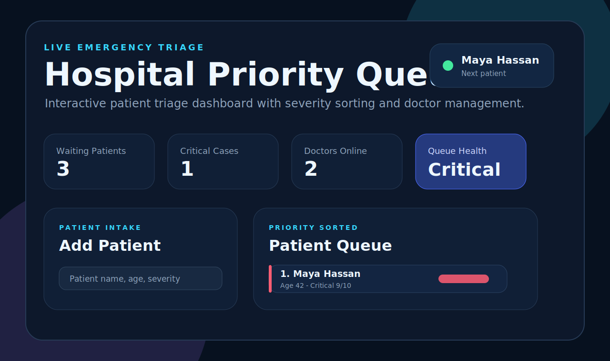
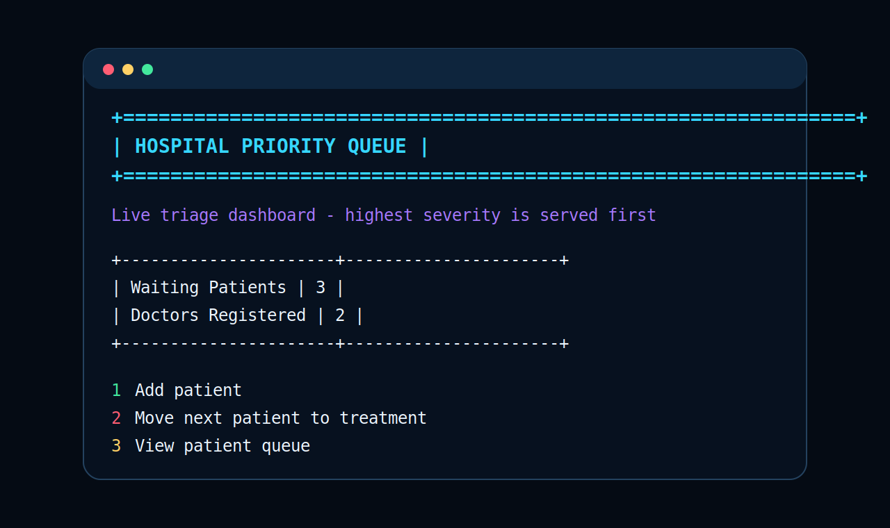

# Hospital Priority Queue

A hospital triage project that manages patients by emergency severity. The repository includes both a modern interactive web dashboard and a C++ console version of the same priority queue idea.

## Screenshots

### Web Dashboard



### C++ Console Dashboard



## Features

- Add patients with name, age, and severity level.
- Automatically sort patients by highest severity first.
- Move the highest-priority patient to treatment.
- Increase a patient's priority from the web interface.
- Remove patients from the queue.
- Add doctors with ID and specialization.
- Search doctors by name or ID in the web dashboard.
- View live stats for waiting patients, critical cases, doctors, and queue health.
- Responsive HTML, CSS, and JavaScript interface.
- Enhanced C++ terminal interface with colored dashboard-style output.

## Tech Stack

- HTML5
- CSS3
- JavaScript
- C++
- Visual Studio C++ project files

## Project Structure

```text
patient-priority-queue/
|-- index.html
|-- styles.css
|-- script.js
|-- patient priority queue.cpp
|-- Hospital.sln
|-- patient priority queue.vcxproj
|-- screenshots/
|   |-- web-dashboard.svg
|   `-- console-dashboard.svg
`-- README.md
```

## Run The Web App

Open `index.html` in a browser.

On Windows, you can double-click:

```text
index.html
```

The web version does not need a server or package installation.

## Run The C++ Console App

Open `Hospital.sln` in Visual Studio and build the project.

You can also build with MSBuild if it is available:

```powershell
msbuild "Hospital.sln" /p:Configuration=Release /p:Platform=x64
```

Then run the generated executable from:

```text
x64/Release/patient priority queue.exe
```

## How Priority Works

Each patient has a severity value from `1` to `10`.

- `8-10`: Critical
- `5-7`: Urgent
- `1-4`: Stable

Patients with higher severity are placed before lower-severity patients. If two patients have the same severity, the earlier patient stays first.

## Web App Interactions

- Use the patient form to add a new queue entry.
- Use the severity slider to set emergency level.
- Click `Treat Next` to remove the highest-priority patient.
- Click `+ Priority` to increase a patient's severity.
- Click `Remove` to delete a patient from the queue.
- Add doctors from the care team form.
- Use the doctor search box to filter doctors by name or ID.

## Notes

This is a front-end/local project. Data is stored in memory while the page is open, so refreshing the browser resets the web dashboard sample data.
